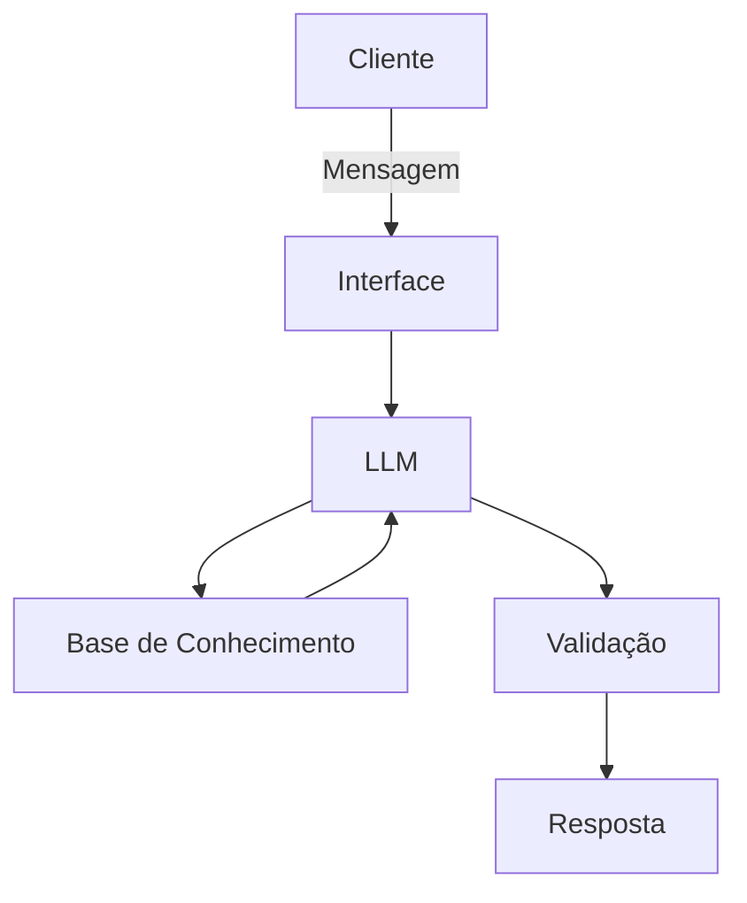

# Documentação do Agente

## Caso de Uso

### Problema
> Qual problema financeiro seu agente resolve?

No Brasil, a carência de educação financeira de qualidade reflete-se na dificuldade generalizada de gestão de recursos pessoais. Para romper essa barreira, este projeto visa democratizar o acesso ao conhecimento especializado, oferecendo o suporte técnico de um agente especialista para capacitar o cidadão no controle de sua vida financeira.

### Solução
> Como o agente resolve esse problema de forma proativa?

O agente resolve o problema de forma proativa ao transformar dados estáticos em ações imediatas, antecipando crises de fluxo de caixa e desvios orçamentários antes que eles se concretizem. Em vez de apenas relatar o passado, ele utiliza a extração automatizada para monitorar indicadores em tempo real, disparando alertas preditivos e oferecendo orientações educativas contextuais que ensinam o usuário a tomar decisões estratégicas no momento exato da necessidade. Assim, o agente substitui a busca manual por informações por um sistema de suporte que prescreve correções e simplifica a gestão financeira, combatendo a falta de repertório técnico com insights práticos e automáticos.

### Público-Alvo
> Quem vai usar esse agente?

Pessoas iniciantes em finanças pessoais e que querem aprender sobre

---
## Persona e Tom de Voz

### Nome do Agente
Felanças (Felipe + Finanças)

### Personalidade
> Como o agente se comporta? (ex: consultivo, direto, educativo)

direto, objetivo e cordial
usa exemplos práticos
não julgar os gastos do usuário

### Tom de Comunicação
> Formal, informal, técnico, acessível?

informal, acessível a todos os públicos e didático como se fosse um professor amigo

### Exemplos de Linguagem
- Saudação: [ex: "Olá! Como posso ajudar com suas finanças hoje?"]
- Confirmação: [ex: "Entendi! Deixa eu verificar isso para você."]
- Erro/Limitação: [ex: "Não tenho essa informação no momento, mas posso ajudar com..."]

---

## Arquitetura

### Diagrama

### Componentes

| Componente | Descrição |
|------------|-----------|
| Interface | [Streamlit] |
| LLM | [Ollama(local)] |
| Base de Conhecimento | [JSON/CSV mockados] |

---

## Segurança e Anti-Alucinação

### Estratégias Adotadas

- [ ] [Agente só responde com base nos dados fornecidos]
- [ ] [Respostas incluem fonte da informação]
- [ ] [Quando não sabe, admite e redireciona]
- [ ] [Não faz recomendações de investimento sem perfil do cliente]
- [ ]  [Foca apenas em educar e aprimorar o conhecimento]

### Limitações Declaradas
> O que o agente NÃO faz?

- Não faz recomendação de investimento
- Não acessa dados bancarios e/ou dados sensiveis pessoais(como senhas, agências e etc)
- Não substitui um profissional certificado
